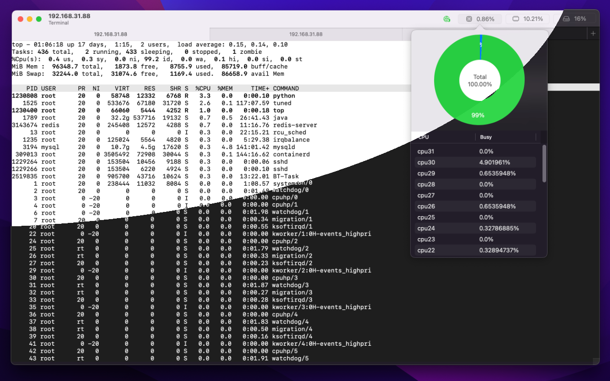
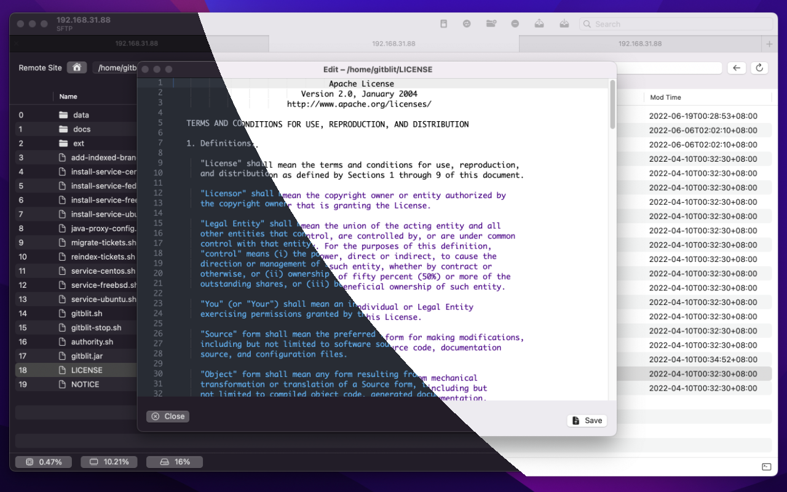
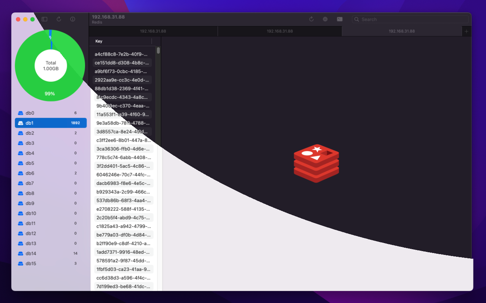
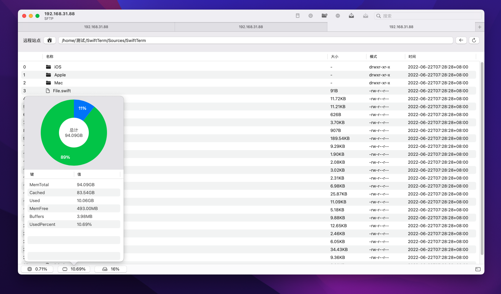
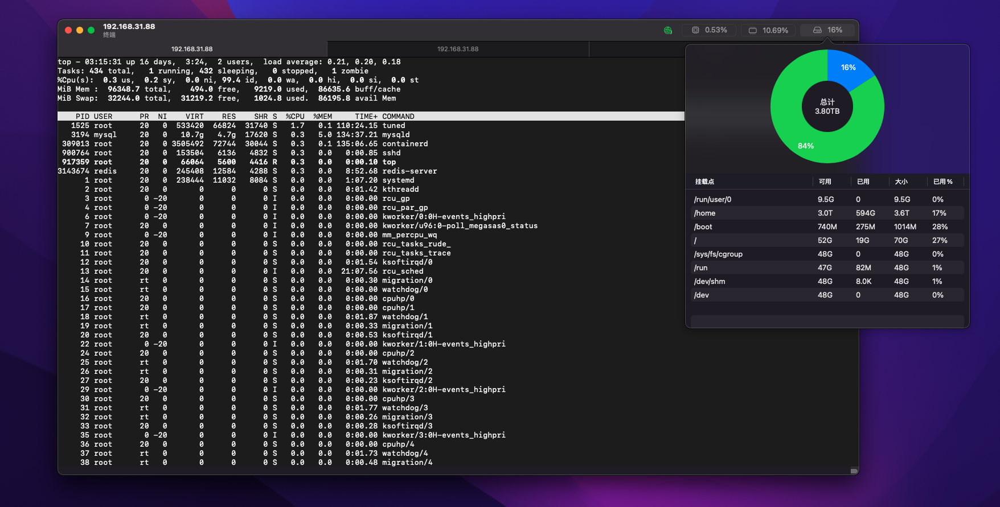
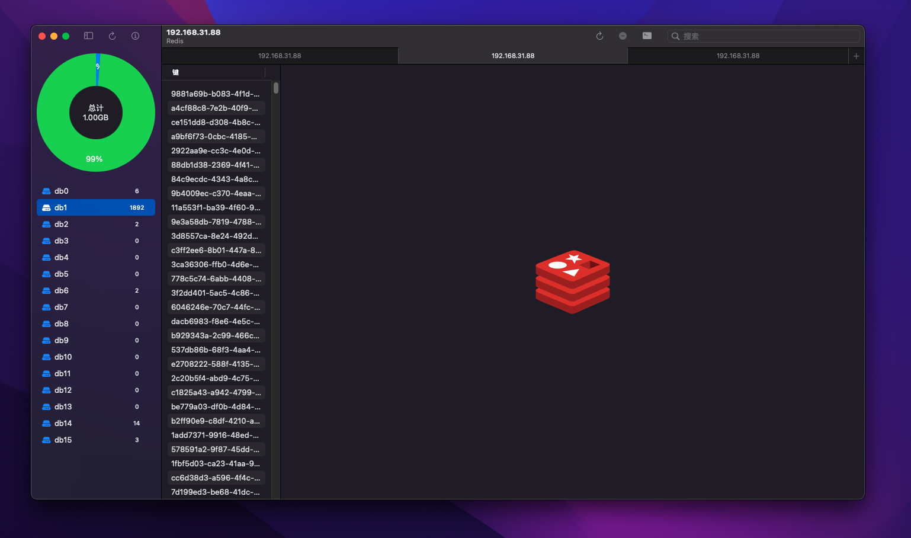
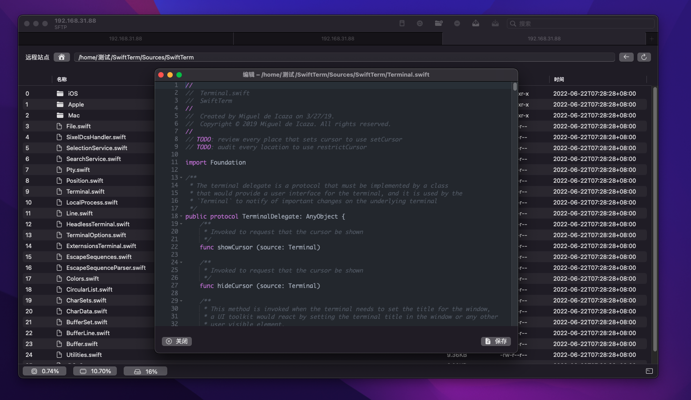

### SSH Term macOS App是一款Linux SSH工具，支持SSH、SFTP、Redis、超过120种语言在线编辑以及监控 CPU、内存和磁盘使用情况等丰富功能

**Features**

- Native Mac app 12.0+
- Run for Intel or Apple Silicon
- App Sandbox
- SSH
- SFTP、Edit and browse pictures online
- Redis
- Monitor CPU, memory, and disk usage
- Free

